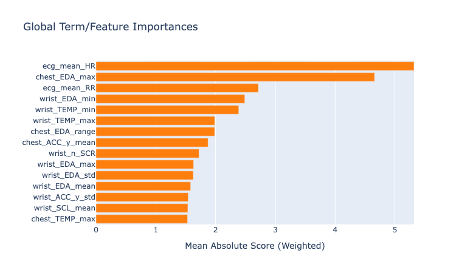
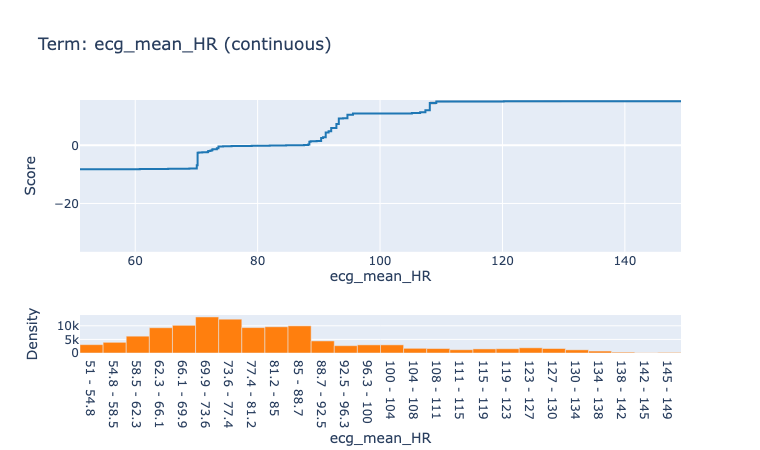
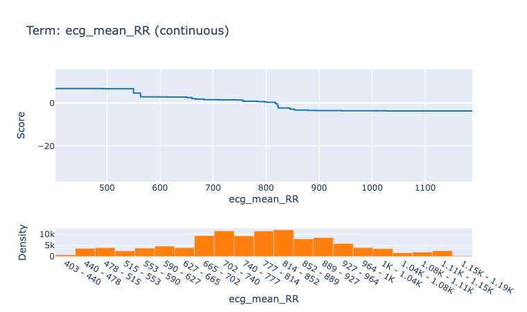

# Interpretable Model Analysis

## 1. Interpretable Model Design

### Why EBM?

This project uses an **Explainable Boosting Machine (EBM)** — a generalized additive model (GAM) of the form:

```
logit(P(stress)) = β₀ + Σᵢ fᵢ(xᵢ) + Σᵢⱼ fᵢⱼ(xᵢ, xⱼ)
```

Each `fᵢ` is a learned shape function over a single feature. This means every prediction is a **sum of per-feature contributions**, each of which can be plotted and interpreted directly. Unlike gradient-boosted trees or neural networks, there is no need for post-hoc approximations (SHAP, LIME) — the model's internals are themsevles the explanation.

---

### ECG Shape Functions


The global feature importance ranking puts `ecg_mean_HR` at the top (importance ≈ 5.3) and `ecg_mean_RR` in the top five. These two features encode the same underlying signal — heart rate — from opposite directions:
- **`ecg_mean_HR`** (beats per minute): the average instantaneous heart rate across the 60-second window
- **`ecg_mean_RR`** (seconds): the mean inter-beat interval (RR interval);

**Shape function — `ecg_mean_HR`:**


The shape function shows a near-flat, mildly negative contribution at low heart rates (~50–75 bpm), then a sharp upward step beginning around **85 bpm**, rising steeply through 100–120 bpm. This captures the physiological reality of the Trier Social Stress Test (TSST): sustained elevated HR is a reliable autonomic marker of sympathetic activation. The model learned a threshold: below ~85 bpm, HR carries little signal; above it, each additional beat per minute adds meaningfully to the stress probability.

**Shape function — `ecg_mean_RR`:**


The shape function is the mirror image. RR is the interval between two R waves, represnting the time between heartbeats. We see that high RR (long intervals, slow heart) → negative contribution (non-stress), short RR (fast heart) → strong positive contribution (stress). The EBM independently discovered this inverse relationship from the data — it was not encoded as a constraint. That both shape functions agree, from opposite encodings, validates that the pattern is real and not an artifact of the windowing or feature extraction.

**Key interpretive takeaway:** The model is not doing arbitrary pattern matching — it has learned a physiologically grounded, monotone relationship between heart rate and stress. The step shape also explains why mean HR outperforms variability measures in this task: what matters is whether HR is sustained above the sympathetic threshold, not how much it fluctuates.

---

### Feature Importance and the Case for Removing ACC

The global explanation ranks features by mean absolute contribution across all test windows. The top features are dominated by ECG-derived measures (`ecg_mean_HR`, `ecg_mean_RR`, `ecg_rmssd`, `ecg_lf_hf`) and chest EDA/respiration. Notably, **accelerometer features** (`chest_ACC_*`, `wrist_ACC_*`) appear with low importance scores — they contribute little to correct predictions on average.

This motivates the **chest_no_acc ablation** (57 features): remove all `_ACC_` features from the chest modality and retrain. The result is not only smaller but *better* — the ACC features appear to add noise rather than signal, likely because the TSST stressor is a speech task (standing, speaking) that induces motion artifacts correlated with task structure rather than autonomic stress.

The EBM made this diagnosis transparent without any external tooling. A black-box model might have silently up-weighted ACC features in ways that looked fine on a balanced accuracy metric but generalized poorly.

---

## 2. Performance vs. Published Baseline

### Schmidt et al. (2018) Benchmark

The original WESAD paper (Schmidt et al., 2018) reports the following binary classification results on the same 3-class-to-binary mapping (stress vs. non-stress), using LOSO cross-validation over all 15 subjects:

| Method | Modality | LOSO F1 | LOSO Acc |
|---|---|---|---|
| LDA | Chest physio (no ACC) | **91.47%** | **93.12%** |
| RF | Chest physio (no ACC) | 90.44% ± 0.66% | 92.01% ± 0.51% |
| AB | Chest physio (no ACC) | 87.11% ± 0.57% | 89.76% ± 0.48% |
| LDA | All chest | 91.07% | 92.83% |
| RF | All chest | 90.04% ± 0.84% | 91.70% ± 0.75% |
| LDA | All physio (wrist + chest) | 90.93% | 92.51% |
| RF | Wrist physio (no ACC) | 86.10% ± 0.29% | 88.33% ± 0.25% |
| LDA | Wrist physio (no ACC) | 83.77% | 86.46% |
| Random (majority class) | — | 41.15% | 69.94% |

The paper's best result is **LDA on chest physiological features (no ACC), 91.47% macro F1 / 93.12% accuracy**.

---

### This Project's Results

| Condition | Features | LOSO F1 | LOSO Acc | Notes |
|---|---|---|---|---|
| **chest_no_acc** | 57 chest, no ACC | **94.4% ± 6.4%** | 95.5% ± 4.6% | Best condition |
| chest_only | 82 chest | 92.4% ± 7.0% | 93.6% ± 5.4% | — |
| no_acc | ~100, all sensors | 92.1% ± 7.3% | 93.1% ± 6.0% | — |
| full (119 features) | all sensors | 91.8% ± 7.1% | 92.9% ± 5.8% | — |
| wrist_only | ~37 wrist | 84.2% ± 9.1% | 86.3% ± 8.4% | — |
| simple | ~31 mean/std only | 89.5% ± 8.2% | 90.8% ± 6.9% | — |
| engineered | ~88 HRV/freq/EDA | 90.9% ± 7.4% | 92.0% ± 6.2% | — |
| random (stratified) | — | ~50% | ~50% | DummyClassifier |

**The chest_no_acc EBM achieves 94.4% LOSO macro F1, surpassing the paper's best LDA result (91.47%) by +2.93 percentage points** on a comparable modality set (chest sensors only).

